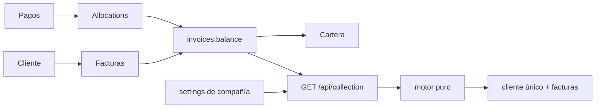

# Arquitectura de cobranza: presente y evolución por fases

Fecha: 05/10/2026. Este documento es una propuesta de separación y de contratos a revisar, no una implementación ni aprobación de nuevos endpoints/tablas. Fuente de negocio: [reglas oficiales](../business/MERTEL_COBRANZA_RULES.md). Estado y evidencias: [auditoría](MERTEL_AUDIT_POST_4_7.md).

## Recorrido existente

La consulta autorizada obtiene reglas y datos mediante modelos con companyScope en una transacción de lectura. collection.service calcula agregados de balances backend y adapta decisiones del motor al contrato HTTP. El motor puro recibe fechas/facturas/reglas, devuelve clasificaciones sin mutar entradas y selecciona una factura principal. React conserva esas decisiones; no escribe balances ni calcula prioridades.

El mapa solicitado cliente → facturas → pagos → allocations → cartera → motor → gestiones → promesas → mensajes → historial → reportes representa el recorrido de trabajo, **no** un acoplamiento donde cada módulo escribe al siguiente. Hasta motor/consulta existe implementación; los módulos operativos posteriores aún requieren sus fases.

## Fronteras para fases futuras

| Frontera | Responsabilidad futura | Invariante |
|---|---|---|
| Fuente financiera | Facturas, pagos y allocations existentes | Solo operaciones backend transaccionales alteran saldo |
| Adaptador de datos/configuración | Contexto autorizado, reglas aprobadas y datos necesarios | No fallback comercial NULL ni acceso cruzado |
| Motor de reglas 4.8 | Jerarquía oficial, factura más atrasada y ventanas confirmadas | Puro, determinista y sin efectos financieros/envíos |
| Gestiones 4.9 | Hechos manuales, actor, fecha y resultado | No detener automatización por mera gestión |
| Promesas 5.0 | Estado y evidencia de promesa | Pausa operativa independiente de saldo y gestión |
| Importación 5.1 | Lectura, preview, validación y conciliación de archivo | Ausencia no equivale automáticamente a cancelación financiera |
| Motor operativo 5.2 | Reevaluación, pausas y decisiones operativas | Separar elegibilidad de etapa, descuento y envío |
| Mensajería 5.3 | Adaptador de proveedor y resultados | Aplicar límites aprobados e idempotencia, sin enviar desde GET |
| Coordinación de pagos 5.4 | Refrescar/reevaluar tras commit financiero | No red ni scheduler dentro de locks de pagos |
| Historial/auditoría | Hechos trazables por actor/origen | Autenticación, operación y finanzas no son una única métrica |
| Reportes 5.5 | Proyecciones sobre hechos definidos | No inventar fórmulas ni escribir deuda desde reportes |
| Administración 5.6 | Edición validada y auditada de configuración | No añadir sistemas comerciales de tenants |

Los eventos/outbox, contratos nuevos, versionado y paginación son opciones técnicas a evaluar en su fase; no hay infraestructura de esos tipos añadida por esta orden.

## Acoplamientos actuales a tratar

1. **Regla de vencimiento y Pronto Pago:** ruleMatches recibe distancia a due_date. Una ventana desde emisión exige ampliar entrada/condición del motor y validar issue_date. No convertir el descuento comercial en una condición implícita de vencimiento.
2. **Selección y prioridad:** el desempate actual favorece proximidad a referencia. Separar jerarquía de etapas, antigüedad y desempates aprobados en 4.8; conservar agrupación por cliente. No ordenar una copia en React para sustituir la factura principal del servidor.
3. **Datos insuficientes:** collection.model no proyecta base_value ni productos. Antes de automatizar descuento, comprobar contrato de líneas, fuente y exclusiones. No presumir que document_value contiene base elegible.
4. **Snapshot e integración financiera:** conciliación actual usa document_value menos allocations activas. Un saldo externo importado puede representar otra base contable. Diseñar conciliación con evidencia antes de una migración o actualización; no ajustar pagos ni allocations como efecto lateral.
5. **UI y catálogo:** cuatro etiquetas estáticas y claves arbitrarias producen un catálogo visual distinto del real. En 4.8 proponer metadatos backend y evolución compatible de `/api/collection`; no declarar ahora un contrato definitivo no implementado.
6. **Estados operativos:** tables collection_actions/payment_promises/messages no implementan máquina de estados ni exclusión de duplicados de envío. Proponer sus invariantes en las fases asignadas, sin activar código por la mera existencia del esquema.
7. **Auditoría:** auditAuth cubre sesión; las operaciones financieras y futuras importaciones necesitan revisar un registro consistente por operación sin exponer secretos. No reutilizar audit_logs como historial de gestiones sin modelo definido.
8. **Carga completa:** la API calcula por cliente tras filtrar facturas en memoria y el frontend busca localmente. Medir volumen autorizado antes de optimizar; no añadir índices/migraciones sin verificar plan de consultas y semántica de cliente único.

## Contratos y seguridad preservados

- La ruta actual sigue siendo GET `/api/collection?reference_date=YYYY-MM-DD`; `stage` y `customer_id` opcionales y company_id para global admin según companyScope. Es de consulta.
- Conservar success/data, reference_date, status, rules_configured, summary y customers; todos los campos de clasificación vienen del backend.
- Nuevos datos comerciales son cambios de contrato revisables de fases posteriores; mantener compatibilidad con frontend y tests cuando se autoricen.
- Sin fallback de reglas globales legacy. Una ausencia de reglas se muestra explícitamente; una falta de datos no crea una regla ni un descuento.
- Autorización sigue en backend, con permisos existentes y aislamiento técnico. Definir permisos operativos en cada fase; no habilitar de una vez todos los previstos.
- Variables explícitas en producción, origen exacto, credentials, Secure/HttpOnly; localhost/Lax solo en desarrollo. No tocar autenticación para introducir funcionalidades de cobranza.

## Evolución de esquema

La 001 es una base histórica y contiene una modificación local protegida: no editar/revertir/commitear. Cambios necesarios en el futuro requerirán migraciones nuevas, aditivas, auditables y probadas sobre base aislada, con estrategia de rollback/recuperación adecuada al cambio. No usar ON DELETE de empresas para mover documentos a contexto legacy ni resolver referencias inexistentes.

Antes de ampliar tablas previstas verificar fuentes de identidad, estados, constraints, deduplicación, relación por compañía y auditoría. Revisar que crear una tabla o almacenar una promesa no autoriza envío ni modificación del saldo.

## Pruebas a planificar, sin implementarlas ahora

- 4.8: prioridad relativa oficial; varias vencidas seleccionan la más antigua; ventanas desde emisión con límites aprobados; no IVA/10%/promo_18; productos desconocidos/mixtos sin descuento automático; cliente único y datos no mutados.
- 4.9–5.0: permisos y auditoría; estados de gestión/promesa; pausa y reanudación según decisiones; sin cambios financieros.
- 5.1: archivo incompleto, duplicado, omitido y reaparecido; preview/idempotencia; balances y allocations intactos hasta operación conciliada autorizada.
- 5.2–5.4: concurrencia, límites y calendario; respuestas inciertas y duplicación de envío; pago confirmado vs aplicado; reversión, saldo cero, deuda parcial y refresco.
- 5.5–6.0: métricas trazables, aislamiento, perf con datos adecuados, backups/restauración y validación real de despliegue.

No se identificó necesidad de cambiar código crítico ahora. El proyecto puede evolucionar mediante estas fronteras y pruebas; las contradicciones de selección/Pronto Pago se corrigen expresamente en 4.8.
